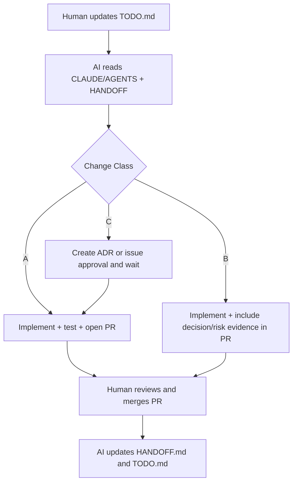
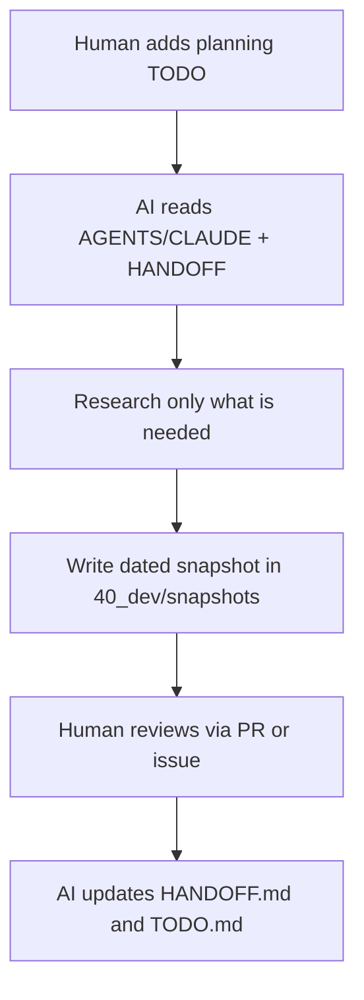
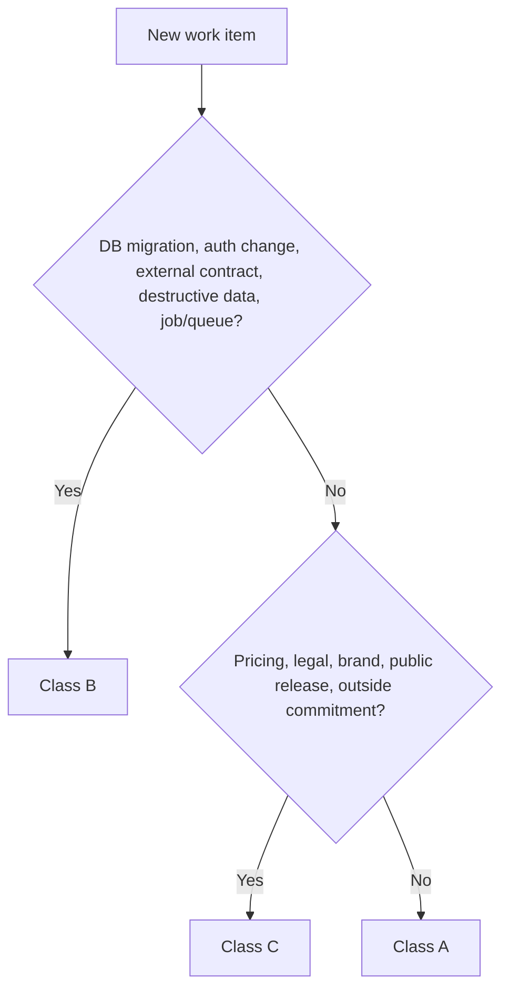

# Diagrams

## Core Workflow

```mermaid
flowchart TD
    A["Human updates TODO.md"] --> B["AI reads CLAUDE/AGENTS + HANDOFF"]
    B --> C{"Change Class"}
    C -->|A| D["Implement + test + open PR"]
    C -->|B| E["Implement + include decision/risk evidence in PR"]
    C -->|C| F["Create ADR or issue approval and wait"]
    F --> D
    D --> G["Human reviews and merges PR"]
    E --> G
    G --> H["AI updates HANDOFF.md and TODO.md"]
```

## Planning-Only Workflow

```mermaid
flowchart TD
    A["Human adds planning TODO"] --> B["AI reads AGENTS/CLAUDE + HANDOFF"]
    B --> C["Research only what is needed"]
    C --> D["Write dated snapshot in 40_dev/snapshots"]
    D --> E["Human reviews via PR or issue"]
    E --> F["AI updates HANDOFF.md and TODO.md"]
```

## Change Class Decision

```mermaid
flowchart TD
    A["New work item"] --> B{"DB migration, auth change, external contract, destructive data, job/queue?"}
    B -->|Yes| C["Class B"]
    B -->|No| D{"Pricing, legal, brand, public release, outside commitment?"}
    D -->|Yes| E["Class C"]
    D -->|No| F["Class A"]
```
