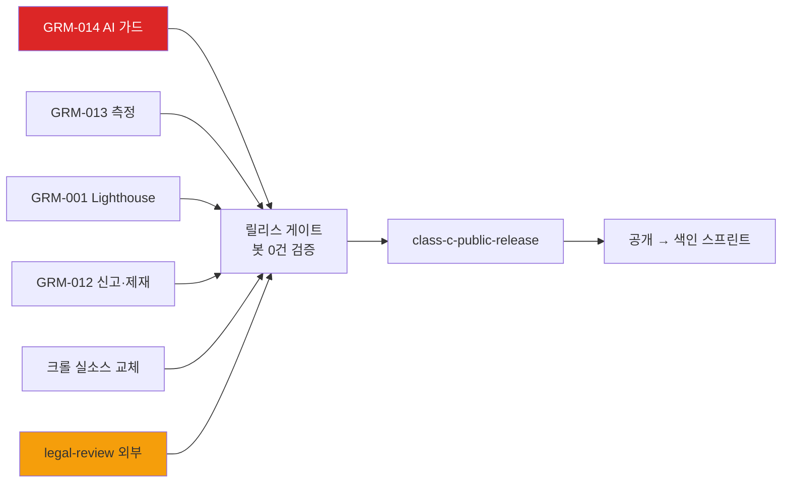

# grooman 개발 마스터 플랜

> 지침 18 v6 기준 — 기능 정의는 11번 **ID 참조만**(복제 금지), 이 문서는 *페이즈 배치·순서·MVP 확정·게이트*만 소유. 2층 구조: 페이즈(여기) → TODO.md(`milestone:` 태그). 프로젝트당 1개, 메이저 갱신은 in-place commit.

## 1. 입력 산출물

frontmatter `inputs` 참조(기획 8종 전부 v1+, 2026-07-22 기준). + **코드 베이스라인**(§18.1 craft): 현존 구현이 시작점 — 재기획 금지.

## 2. 코드 베이스라인 스냅샷 (§18.1 — retrofit 시작점)

| 기능영역 (11번 ID) | 현재 구현 상태 | 다음 갭 |
|---|---|---|
| F1 콘텐츠 소비 | ✅ 완료 (27라우트·FTS·HOT) | Lighthouse 감사(GRM-001) |
| F2 UGC | ✅ 완료 | — |
| F3 계정·성장 | ✅ 완료 (OAuth 3종·레벨·알림) | 정지 상태 없음(G4) |
| F4 자동수집 + AI-001 | ✅ 동작 | fail-open 가드(B4)·스키마 검증(B3)·temp 0(B1) |
| F5 운영 콘솔 | ✅ 기본 | 신고 처리 큐·정지 액션(G1+G4) |
| F6 수익 | ✅ 구현 | AdSense 게재 확인(인간 액션) |
| F7 신고 | ❌ DB만 | 신고 UI 전체(G1) |
| 측정 | ❌ 전무 | GA4·Search Console(G5) |

## 3. 가정 / 비-목표 / 제약

- **가정**: PM기획서 §7 RAID 정본(RPM·색인·SLA 72h·티어·가용시간) — 깨지면 영향 페이즈: M2~M3.
- **비-목표(페이즈 재명시)**: M1~M2 전 기간 — 쪽지·앱·자체커머스·채팅·전문가인증·여성 ✕(11 §8 정본) · **M3 전 유료 마케팅 ✕**(13 §7 게이트).
- **제약**: ① **법률 검토 = 외부 차단**(소요 미지, M1 게이트 선행 — PM 크리티컬 패스) ② 1인+AI(병렬은 AI 작업만) ③ 골든셋 v1 전 AI-001 프롬프트·모델 변경 동결(17 §1).

## 4. 비전 → 페이즈 매핑

| 비전 요소 (출처) | 페이즈 | 검증 지표 (정본) |
|---|---|---|
| "검색으로 닿는 중립 정보처" (10 §3) | M1→M2 | KR1: 색인 500+·MAU 5천 (15 §2) |
| "실경험이 광고를 이긴다" (14 §3) | M2 | KR2: 가입 1%·첫 기여 20% |
| "커뮤니티 자생" (10 §9) | M3 | KR3: 재방문 30%·UGC 비율↑ |

## 5. 아키텍처 결정 요약

- **토폴로지**: Next.js14(App Router) → Supabase(PG·Auth·RLS·Realtime) / Vercel(호스팅·Cron) → `/api/crawl` → Claude Haiku(AI-001) / Cloudinary(이미지) / AdSense(수익).
- **외부 의존·대안**: Supabase·Vercel(대안 없음 — 리스크 등록, 티어 가정 ③) · Anthropic API(대안: provider 중립 프롬프트 — AI-001 §14) · AdSense(대안: 제휴 M3).
- **ADR 인덱스**: [0001](adr/0001-rss-auto-crawl-ai-pipeline.md) 크롤 파이프라인 · [0002](adr/0002-bot-seeding-cold-start.md) 봇=픽스처(M1 게이트 근거) · [0003](adr/0003-rls-security-model.md) RLS 모델(GRM-012가 RLS 확장 — M1 진입 시 재검토).

## 5.5 페이즈 정의 (§6.1 — 5필드)

> M0는 완료된 과거(베이스라인) — 게이트 소급 없음. 사업기획서 P-표기와 매핑: M1=P1 준비+공개, M2=P2, M3=P3.

| 페이즈 | 목적 | 진입 조건 | 종료 조건 (측정 가능) | 휴먼 게이트 | 산출물 |
|---|---|---|---|---|---|
| **M0 구축** (완료) | 제품+거버넌스+기획 체계 | — | ✅ 빌드·기획 7종 머지 | (소급 없음 — retro ADR 3건이 증거) | ADR 0001~0003·기획 8종 |
| **M1 공개 준비·공개** | 공개 가능한 상태 만들기 + 색인 시작 | master-plan-approval 통과 | GRM-012·013·014 머지 + Lighthouse 90+(GRM-001) + 크롤 실소스 교체 + **봇 0건 검증** + 색인 100+ | **① legal-review(외부) ② class-c-public-release(hayden)** | 마이그레이션 005+(신고·정지)·측정 가동·릴리스 게이트 기록 |
| **M2 전환 검증** | 검색 유입→UGC 전환 루프 검증 | M1 종료 + KR1 추세 확인 | KR2 판정 데이터 확보(가입 1%·첫 기여 20% — 달성/미달 모두 "판정"이면 종료) | phase-entry/M2(hayden) · pre-launch-eval 변형(골든셋 v1+baseline, 17 §7) | 전환 개선 빌드(UGC 병치·CTA·microcopy)·llms.txt·FAQ schema·골든셋 v1 |
| **M3 수익 다변화** | 제휴·후원 가동 | KR2 성공 판정 + 유료 3조건(13 §7) | 제휴 링크 가동 + RPM 실측으로 사업 §11 가정 교체 | class-c-budget(hayden) | 제휴 통합·후원 지면 |

> ⚠️ **인라인 가드(§18.3)**: ① legal-review 완료 전 **공개 배포 금지** — clinic 카테고리가 열린 채 공개하면 의료광고법 노출(PM 프리모템) ② 봇 teardown 없이 공개 금지(SOP_public-release-gate) ③ 골든셋 v1 없이 AI-001 프롬프트 변경 금지.

## 6. 의존성 그래프 (M1 내부)

- GRM-014·013·001은 상호 독립 — AI 병렬 실행 가능. **크리티컬 패스 = legal-review**(외부·소요 미지).

## 7. MVP 확정

- **in-scope (M1 공개 시점의 제품)**: F1~F6(구현 완료) + **F7 신고**(GRM-012) + 측정(GRM-013) + AI-001 가드 강화(GRM-014). — 11번 ID 참조, 상세는 11번.
- **out-of-scope**: 11 §8 비목표 6건 + 신고자 결과 통보 상세(M2)·운영 감사 로그(M2)·검수 게이트(선택, M2 재검토).
- **MVP 정의 게이트**: 본 문서 v1의 PR 리뷰 = `master-plan-approval` — 승인 전 M1 이후 페이즈는 잠정.

## 8. AI 기능 통합 (16/17 연계)

| AI 기능 | 진입 페이즈 | Eval-First 게이트 | 가드 |
|---|---|---|---|
| AI-001 크롤 분석 | M0에 이미 운영 중(retrofit 예외) | **소급 게이트**: M1 중 GRM-014(fail-closed) → M2 진입 시 골든셋 v1+baseline 의무(17 §7 pre-launch-eval 변형) | 4-cat 인스턴스(AI-001 §8) — clinic 유출 0건 hard |

- 모델: `claude-haiku-4-5-20251001` 핀 — 교체 시 model-swap 게이트(회귀 통과+Class B). 페이즈별 비용 가정: 전 페이즈 월 ~₩3천(크롤 볼륨 불변 — 사용자 무관 준고정, 캡 ₩10k/₩30k).
- 신규 AI 기능(예: 사용자향 요약·추천)은 **11번에 F-ID 정의 + 16번 AI-00N 명세 선행** 없이 페이징 금지.

## 9. 리스크 & B/C 트리거

**B/C 트리거 사전 매핑 (§9.1)**:

| 페이즈 | 트리거 | Class | 사전 준비 |
|---|---|---|---|
| M1 | GRM-012 스키마·RLS 변경 | B | PR에 롤백 절(TODO AC에 포함됨) |
| M1 | 공개 배포 | **C** | SOP + legal-review + 명시 승인 |
| M2 | 검수 게이트 도입(자동 게시 변경 — ADR-0001 수정) | B | 도입 결정 시 ADR 선행 |
| M3 | 유료 마케팅 예산 | **C** | 13 §7 3조건 증빙 |
| any | clinic enum 차단 해제 | **C** | 금지 기본 — 해제는 ADR+법률 재검토 |

**결정 보류(§9.2)**: ① 검수 게이트 도입 여부 — M2 진입 시(HANDOFF CRAWL-1) ② 심볼/캐릭터 — M2 재검토(14 §9) ③ 자동수집 상한 30% 하향 시점 — M2 중(12 §4.2).

**페이즈 진입 시 재평가(§9.3)**: PM §7 가정 5건 + 모델 deprecation 일정 + Supabase/Vercel 티어 한도.

## 10. 리소스·처리량

- 1인(hayden: 승인·법률·계정) + AI(구현·문서) — 딜리버리 모델은 15 PM기획서 §0 선언 참조(하이브리드).
- throughput: 실측 데이터 없음 — **M1 완료 시점에 TODO Done 추이로 초기 실측** 후 본 절 갱신(M2부터 Monte Carlo 검토 — 15 §0 미적용 선언과 정합).

## 11. 게이트 매핑 (15 §10 카탈로그 → 인스턴스, §18.4 라이프사이클)

| 게이트 ID | 인스턴스 | 승인자 | 상태 |
|---|---|---|---|
| master-plan-approval | 본 문서 v1 PR | hayden | **활성 — 이 PR** |
| legal-review | 임시조치·clinic 검토 의견서 | 외부 자문 | 활성 (M1 차단 — 착수 대기) |
| class-b-schema | GRM-012 PR | hayden | 활성 |
| class-c-public-release | M1 말 공개 승인 | hayden | 활성 |
| pre-launch-eval(변형) | M2 진입 시 골든셋 v1+baseline | hayden | 이연 → M2 |
| class-c-budget | M3 유료 진입 | hayden | 이연 → M3 |
| model-swap · regression-override · policy-change | 발동 시 | hayden | 대기성 |

## 12. 환류 트리거

- 갱신 신호: KR 지표가 페이즈 종료 조건과 어긋남 · 11번 메이저 갱신 · 모델 deprecation 공지 · 비용 캡 초과 · B/C 중간 발동 → **본 문서 in-place 갱신 + TODO `milestone:` 재조정**.

## 변경 이력

| 버전 | 날짜 | 요약 |
|------|------|------|
| v0 | 2026-07-21 | 스켈레톤 |
| v1 | 2026-07-22 | 전 섹션 — 코드 베이스라인 스냅샷·M0~M3 페이즈(5필드·인라인 가드)·의존성 그래프·MVP 확정·AI-001 소급 게이트·B/C 사전 매핑·게이트 라이프사이클(활성/이연). Trigger: 기획 시리즈 7/7 완료(GRM-011) |
