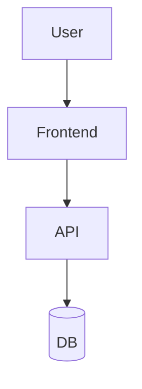
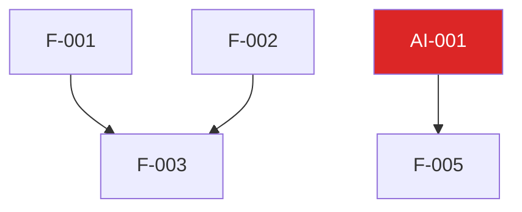

# [PROJECT_NAME] 개발 마스터 플랜

> 작성 지침: `20_guides/18_개발_마스터_플랜_작성_지침.md`
> 프로젝트당 1개. 메이저 갱신은 in-place commit으로 누적한다.
> **SSOT (v5).** 기능 정의는 복제하지 않는다 — `기능 ID + 한 줄 요약 + 11번 링크`만. 상세는 11번(원본). 18이 소유하는 건 *페이즈 배치·순서·게이트*뿐.

---

## 1. 입력 산출물

| 입력 | 출처 | 버전/commit | 사용 목적 |
|------|------|------------|-----------|
| 비즈니스 모델 | 10 §6 | | |
| 사용자 시나리오 | 11 §6, §9 | | |
| AI 기능 ID | 16 §1 | | |
| 게이트 카탈로그 | 15 §6.16 | | |
| 위험 등록부 | 15 §6.17 | | |

---

## 2. 가정 / 비-목표 / 제약

### 2.1 가정
- [ ]

### 2.2 비-목표 (페이즈 단위)
- [ ]

### 2.3 제약
- [ ]

---

## 3. 제품 비전 → 페이즈 매핑

| 비전 요소 | 출처 | 매핑 페이즈 | 검증 지표 |
|----------|------|------------|----------|
| | | | |

---

## 4. 아키텍처 결정 요약

### 4.1 컴포넌트 토폴로지

### 4.2 데이터 흐름
-

### 4.3 외부 시스템 의존
| 의존 | 페이즈 | 대안 | 리스크 등록 |
|------|--------|------|------------|
| | | | |

### 4.4 ADR 인덱스
-

---

## 5. 페이즈 정의

### M0 — [페이즈 제목]
- **목적**:
- **진입 조건**:
- **종료 조건**:
- **휴먼 게이트**:
- **산출물**:
- **기능 ID (11번 참조)**:
- **AI 기능 ID (16번 참조)**:

### M1 — [페이즈 제목]
- **목적**:
- **진입 조건**:
- **종료 조건**:
- **휴먼 게이트**:
- **산출물**:

---

## 6. 의존성 그래프

---

## 7. MVP 확정

### 7.1 in-scope (M0~M1)
- [ ] F-001
- [ ] F-002

### 7.2 out-of-scope (V2 이후)
- F-099 — [거부 사유]

### 7.3 MVP 정의 게이트
- 승인자:
- 형식:
- 마감:

---

## 8. AI 기능 통합 전략

### 8.1 AI 기능 페이즈 배치
| AI 기능 ID | 페이즈 | Eval-First 게이트 | 가드 카테고리 | 모델 |
|-----------|--------|------------------|--------------|------|
| AI-001 | M1 | 골든셋 100건 통과 | A, B, C | claude-3.5-sonnet |

### 8.2 모델 선정·교체 전략
-

### 8.3 가드레일 시점
-

---

## 9. 리스크 & 미해결 결정

### 9.1 B/C 트리거 후보
| 페이즈 | 트리거 | Class | 사전 ADR |
|--------|--------|-------|---------|
| | | | |

### 9.2 결정 보류 항목
| 항목 | 결정 마감 | 결정자 |
|------|----------|--------|
| | | |

### 9.3 페이즈 진입 시 재평가 항목
- 가정 §2.1
- 외부 SLA §4.3
- 모델 deprecation §8.2

---

## 10. 리소스·일정 가정

- **인원·역할**:
- **속도(velocity)**: M0 종료 시 실측 갱신
- **외부 차단**:

---

## 11. 게이트 매핑

| 게이트 ID | 카탈로그 출처 | 인스턴스 | 승인자 | SLA |
|-----------|--------------|---------|--------|-----|
| master-plan-approval | 15 §6.16 | 마스터플랜 v1 승인 | Primary Approver | 5d |
| phase-entry/M1 | 15 §6.16 | M1 진입 게이트 | Tech Lead + PM | 2d |

---

## 12. 환류 트리거

- 환류 신호: [eval 회귀 / 비용 +30% / 기능 재정의 / SLA 변경 / B/C 발생]
- 갱신 시 영향 문서:

---

## 변경 이력

| 버전 | 날짜 | 요약 |
|------|------|------|
| v1 | YYYY-MM-DD | 초기 작성 |
