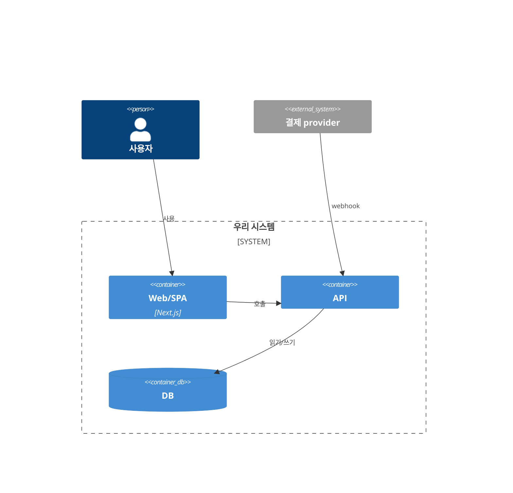

# 아키텍처 (Architecture) — 템플릿

> 용도: **어떻게** 만들 것인가. 짝 문서 [`prd.md`](prd.md)(무엇). 현재 코드(as-built)에서 출발해 목표·이전 경로를 기술. **경량 문서 모드**의 2번째 축. 지침 `20_guides/18_개발_마스터_플랜_작성_지침.md` · `20_guides/19_클린아키텍처_클린코드_개발규칙.md` 참조. 표준: arc42(섹션 매핑) · C4(다이어그램) · fitness functions.
> 상태: Draft · 최종 수정 YYYY-MM-DD · 본 문서가 코드 디테일과 어긋나면 **코드를 따른다**.
> **risk-driven("just enough")**: 리스크에 비례해 쓴다 — 저위험은 생략, 결제·인증 같은 고위험은 §6 런타임·§11 위협을 깊게. 이 문서 + ADR + diagrams-as-code는 **AI 코딩 에이전트의 durable 컨텍스트**로도 쓰인다(그래서 C4·명시적 품질특성·fitness function이 값을 함).

## 1. 설계 원칙 (Solution Strategy)
1. (예: 공개 우선 / 돈·재고는 DB에서 / 결제는 웹훅이 확정 / 데이터 격리 / 점진 이전)

## 2. 품질 속성 우선순위 (Quality Attributes — top 3)
> "모두 최적화할 수 없다 — 최선이 아니라 **least-worst**를 노린다." 도메인/이해관계자에서 도출(기술 취향 아님). 각 특성은 *측정 시나리오*로.

| 순위 | 특성(-ility) | 왜(도메인 근거) | 측정 시나리오(목표치) | 트레이드오프(양보) |
|---|---|---|---|---|
| 1 | (예: 일관성/무결성) | 결제·정산 | 이중지불 0 · webhook 유실 0 | 지연 일부 |
| 2 | (예: 가용성) | | p95 < 300ms @ 500rps · 99.9% | 비용↑ |
| 3 | (예: 배포성) | 속도 | main→prod < 15분 · 롤백 < 5분 | 초기 구조 비용 |

- 후보였으나 *의도적 제외*: (특성 — 이유)

## 3. 현재 스택 (as-built)

| 레이어 | 구현 | 위치 |
|---|---|---|
| 프레임워크 | | |
| 데이터 | | |
| 인증 | | |
| CI/CD | | |

## 4. 목표 아키텍처 (C4 — Context + Container)
> C4: 레벨1 System Context(시스템 1박스 + 사용자 + 외부 시스템) → 레벨2 Container(배포 단위: 웹·API·DB·큐·SPA). *대부분 레벨1+2면 충분*, 복잡한 컨테이너만 레벨3 Component. diagrams-as-code(Mermaid)로 리포에 둔다.



## 5. 기술 스택 (목표)

| 영역 | 선택 | 비고 |
|---|---|---|

## 6. 런타임 뷰 (핵심 시나리오만)
> 비자명하거나 신뢰 경계를 넘는 흐름 1~3개만 시퀀스로(결제 완료=webhook-as-truth·인증·mock→real 경계 등).

```mermaid
sequenceDiagram
    참여자→>API: 요청
    API->>DB: 원자 연산(멱등)
    결제->>API: webhook(서명검증) → 확정
```

## 7. 데이터 모델 (핵심 엔티티 — 키 컬럼만)
> 상세 스키마·마이그레이션은 `data-model.md`.

## 8. 권한 모델

| 대상군 | 읽기 | 쓰기 |
|---|---|---|
| 공개 카탈로그 | 공개 | staff/admin |
| 사용자 데이터 | 본인 | 본인(+신뢰 경로) |

## 9. 트랜잭션·무결성 (원자 연산)
- (돈·재고·동시성이 걸린 연산은 앱 레벨이 아니라 *DB 신뢰 경로*에서. 멱등·감사 가능.)

## 10. 통합 (인증·결제·외부 서비스)
- **결제 진실원 = 웹훅 + 멱등 처리** (클라이언트 성공 콜백만으로 확정 금지).

## 11. 신뢰 경계 · 위협 뷰 (STRIDE-lite)
> 위협은 *신뢰 경계*에 몰린다 — 경계별 관련 STRIDE만. 완화는 §8 권한·§9 멱등을 재사용.

- **데이터 흐름/경계**: 인터넷 ↔ API · API ↔ DB · 앱 ↔ 결제/외부 (경계선 표시)

| 경계 | 위협(STRIDE) | 완화 |
|---|---|---|
| 인터넷↔API | Spoofing/Elevation | authn · rate-limit · authz 매트릭스(§8) |
| API↔결제 webhook | Tampering/Repudiation | 서명검증 · idempotency(§9) · webhook=truth |
| 앱↔스토리지 | Info disclosure | 서명 URL · 스코프 |

## 12. 미디어 / 스토리지

## 13. 검색

## 14. 배포 뷰 (Deployment)
> 환경·인프라 토폴로지 + 블록→인프라 매핑. §2 지연·비용 예산이 강제되는 지점.

| 환경 | 호스팅/노드 | 비고 |
|---|---|---|
| dev / stg / prod | | |

## 15. AI 아키텍처 (AI/LLM 포함 시에만)
> 상세(프롬프트·모델·평가)는 지침 16/17·`prd.md` §9. 여기엔 *배치*만.
- **모델 게이트웨이/라우터**: 단일 진입점 · provider 추상화(cost/latency 라우팅)
- **폴백/페일오버**: primary→secondary · 타임아웃·재시도
- **RAG/검색**: 소스 · 임베딩·인덱스 · 컨텍스트 조립 위치
- **가드레일 위치**: 입력(프롬프트 인젝션)·출력(모더레이션·스키마 검증) = 게이트웨이 계층
- **Evals 위치**: CI eval suite(회귀 게이트) → eval doc
- **예산(아키 레벨)**: 요청당 토큰·비용 상한 · p95 지연 목표
- **에이전트 오케스트레이션**(있을 때): 툴 목록 · 루프/스텝 상한 · trace 관측

## 16. 적합성 함수 (Fitness Functions → CI 가드레일)
> §2 품질 특성을 *객관적·자동* 검사로 → 아키텍처가 조용히 침식되지 않게. 지침 19 가드레일과 연결.

| 특성 | 지표 | 검사(도구) | 임계 | 실행 위치 |
|---|---|---|---|---|
| 계층 무결성 | 의존 방향 | dependency-cruiser/ArchUnit | 위반 0 | CI lint |
| 유지보수 | 순환 의존 | madge --circular | 0 | CI |
| 성능 | p95 latency | k6 부하 | < 300ms | CI perf/주기 |
| 코드 품질 | max-lines·any·console | eslint 래칫 | 증가 0 | CI |

## 17. mock → real 이전 경로 (브라운필드)
1. 스키마 → 2. 시드 → 3. 읽기 교체 → 4. 액션 도입 → 5. 결제 연결 → (PRD 출시 단계 순서를 따른다)

## 18. 목표 디렉토리 (증분)
```
(현 구조에서 *추가/격하*되는 부분만 증분 표기)
```

## 19. 규제의 기술적 매핑 (해당 시)
> PRD §7 규제 요구사항을 *기술 구현*으로 1:1 매핑.

| 규제 (요구사항) | 기술 반영 |
|---|---|
| | |

## 20. 리스크 · 기술부채 (register)
> §21 미해결 *결정*과 구분 — 이건 이미 안고 있는 리스크·부채. 브라운필드의 mock→real 잔여·미도입 fitness function이 여기로.

| 리스크/부채 | 영향 | 가능성 | 완화·상환 계획 |
|---|---|---|---|

## 21. 미해결 결정
- (단일 vs 멀티 / 임계 넘는 시점의 교체 등 — 결정 시점과 함께. 비가역이면 ADR로.)

**원칙**: 현재 코드가 출발점이다 — 재설계가 아니라 *as-built → 목표 → 이전 경로*로 쓴다. 품질 특성은 top 3만 우선순위화(least-worst)하고 fitness function으로 강제. 다이어그램은 C4·Mermaid(diagrams-as-code). 비가역 아키텍처 결정은 ADR로 분리하고 여기엔 요약만. 리스크 비례로 "just enough".
