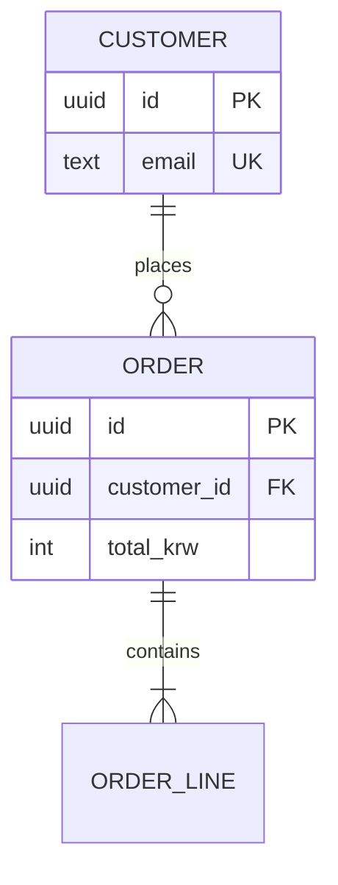

# 데이터 모델 (Data Model) — 템플릿

> 용도: 엔티티·필드·관계·무결성·마이그레이션 명세. 기획 산출물 하류의 개발명세. 지침 `20_guides/18_개발_마스터_플랜_작성_지침.md` §18.5 · `20_guides/21_개발명세_작성_지침.md` 참조. 전송 형태·계약은 `api-contract.md`(중복 금지, 링크).
> **Class B 직결**: DB migration/schema 변경은 CLAUDE.md §3 Class B — impact scope·rollback을 §7이 선제 충족.
> **정규화 기본 = 3NF**(1NF 원자값·2NF 부분종속 제거·3NF 이행종속 제거). *비정규화는 의도적으로만* — 실제 읽기 병목 측정 후, 사유 + 동기화 방식(트리거/MV/앱)을 §5에 명기.

| 항목 | 내용 |
|------|------|
| 버전 / 작성일 / Status · 스키마 계약 버전 | (api-contract와 연동) |
| 기반 문서 (상류) | |
| 범위 (Phase/Sprint) | |

## 1. ERD (Mermaid — crow's foot)
> 카디널리티: `||`정확히1 · `o|`0또는1 · `|{`1이상 · `o{`0이상. 선: `--` 식별(존재종속) / `..` 비식별. 라벨 필수. 엔티티 UPPERCASE·공백 금지.

## 2. Entity List

| Entity | 목적 | Owner(도메인) | PK 전략 | History |
|---|---|---|---|---|
| | | | (surrogate: bigint / **UUIDv7**·ULID / natural) | (none/soft-delete/SCD2/append-only/bi-temporal) |

> **키**: surrogate(무의미 시스템 생성) 기본. 분산·외부노출이면 **UUIDv7/ULID**(시간정렬 → 인덱스 지역성; UUIDv4 랜덤은 PK 비권장·RFC 9562). 외부 노출 ID는 *별도 opaque public ID*(순번 정수 URL 노출 금지). natural 키는 진짜 불변·유일할 때만.

## 3. Fields (엔티티별)

### <Entity 명>  · PK: (id, 타입)

| Field | Type | Key(PK/FK→E/UK) | Required | Constraints (default·CHECK·enum) | Indexed?(왜) |
|---|---|---|---|---|---|
| | | | Y/N | | |

## 4. Relationships

| From | To | Type (1:1/N:1/N:M) | On Delete | On Update | Notes |
|---|---|---|---|---|---|
| | | | CASCADE/RESTRICT/SET NULL/NO ACTION | | |

> **cascade 결정**: 부모의 *일회용 부품*(댓글·좋아요·라인아이템·세션) = `CASCADE` / *독립적으로 중요*(주문·인보이스·감사·회계) = `RESTRICT`(고아 차단) / 부모보다 오래 살되 링크만 잃음(글→작성자) = `SET NULL`(FK nullable). 대용량 CASCADE는 대량 삭제 부하 주의.

## 5. Integrity · 제약 · 이력
- **제약(스키마에 박기)**: NOT NULL · UNIQUE · CHECK(값 범위·비즈 규칙, 예 `CHECK(price>=0)`) · DEFAULT · enum. 앱 코드만 믿지 않는다.
- **감사 컬럼**: `created_at`·`updated_at`(+`_by`) 기본.
- **History 전략(엔티티별, §2 태그)**: `soft-delete`(`deleted_at` — 이력 보존·참조 안전, but 어디서나 필터 필요 + **GDPR 삭제 불충족**) · `SCD2`(old행 `valid_to` 마감 + new행 `valid_from`, 완전 이력 — effective-dating의 정식형, 지침 11 §19.3) · `append-only/event log` · `bi-temporal`(valid time + record time).
- **인덱스 원칙**: **FK 컬럼은 명시적 인덱스**(Postgres 자동 생성 안 함 — 없으면 부모 삭제·조인 seq scan) · 잦은 WHERE/JOIN/ORDER BY · 복합(leftmost prefix)·covering(`INCLUDE`)·partial(`WHERE deleted_at IS NULL`). 인덱스마다 쓰기·저장 비용.

## 6. Privacy / PII / 보존

| 필드 | 분류(public/internal/PII/민감) | 암호화(at-rest/컬럼/해시조회) | 접근(role) | 보존기간 | 삭제 경로 |
|---|---|---|---|---|---|

- **데이터 최소화**: 필요한 것만 수집 + 적법 근거 기록.
- **GDPR 삭제권(Art.17)**: 원본뿐 아니라 *파생 데이터*(임베딩/벡터·캐시·백업·로그)까지 삭제/익명화 경로 명시(대부분 여기서 누락).

## 7. Migration (Expand → Contract, 무중단)
> Class B rollback 증거. 각 단계 독립 배포·독립 가역.

1. **Expand** — 새 컬럼/테이블/인덱스 추가(기존 제거 0), 앱은 **dual-write**(old+new)·읽기는 old 유지. 쿼리 안 깨짐. (`CREATE INDEX CONCURRENTLY` 등 lock-safe DDL)
2. **Backfill** — 기존 행을 **청크 단위**(중간 휴지, 롱락·거대 트랜잭션 회피)로 채우고 검증 → 읽기를 new로 전환.
3. **Contract** — 모든 인스턴스가 new만 쓰면 old 컬럼/인덱스 제거.
- 단계별 **롤백 방법** 명기 · Pending Migrations(직접 실행) · Backfill 규모(N행/시드).

## 8. AI / Vector (AI·RAG 기능 있을 때만)
- **임베딩 컬럼**: `vector(N)`(pgvector) — N = 모델 차원(예 1536=`text-embedding-3-small`; HNSW 2000-dim 한계).
- **모델·전처리**: 임베딩 모델 + 전처리 명기(ingest·query 시 동일해야).
- **ANN 인덱스**: **HNSW**(기본) — `m`·`ef_construction`·`ef_search`.
- **재수집·삭제**: 원본 삭제 시 벡터 tombstone/재수집(§6 삭제권과 연결).

## Change Log

| Version | Date | Changed Because |
|---|---|---|

**원칙**: 정의(스키마)와 적용(migration/backfill)을 분리하되 연결. 3NF 기본·비정규화는 사유와 동기화 방식 명기. FK엔 인덱스·cascade 명시. 무중단은 expand-contract(단계별 가역). PII는 분류·보존·삭제(파생 포함)까지. 차기 Phase 확장 필드는 default와 함께 미리 박아둔다. 전송 계약은 api-contract가 원본.
