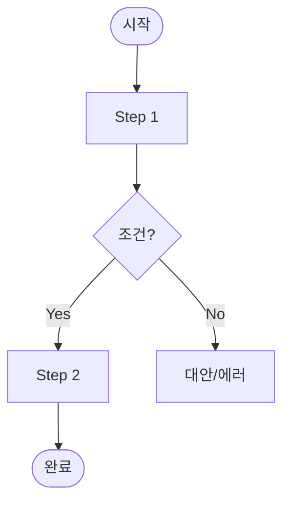

# 사용자 플로우 (User Flow) — 템플릿

> 용도: 화면/기능 단위 사용자 흐름 — 정상·대안·실패·분기를 표로 분리. 지침 `20_guides/11_서비스기획서_작성_지침.md` §19.2(⑥ 플로우차트) · `20_guides/18_개발_마스터_플랜_작성_지침.md` §18.5 참조.
> 2025-26: 다이어그램은 **Mermaid(diagram-as-code)** 로 — 텍스트라 diff·버전관리 가능하고 GitHub/Notion 렌더, AI가 프롬프트에서 생성. AI 시대 문서의 잔여 가치 = *불행 경로*(에러·복구)이므로 표로 강제.

| 항목 | 내용 |
|------|------|
| 버전 / 작성일 / Status | |
| 기반 문서 (상류) | |
| 범위 (Phase/Sprint) | |
| Entry points (진입 트리거) | (딥링크·광고·내비·알림) |
| Exit / success criteria (완료 정의) | |

## Flow: <플로우명>

### 1. Objective
- User goal:
- Business goal:

### 2. Entry Conditions
- (진입 전제: 로그인 상태·선행 데이터 등)

### 3. Diagram (Mermaid)
> 노드 `A[처리]` · `B{분기}` · 라벨 분기 `B -->|Yes| C`. 시스템·API 타이밍이 중요하면 `sequenceDiagram` 병용.

### 4. 경로 표 (해피 + 불행을 한 줄에)

| Step | Actor(user/system/3rd) | Happy path | 대안 / 에러 경로 + 복구 |
|---|---|---|---|
| | | | |

### 5. Decision Points

| 분기 | 판단 기준(Criteria) | Yes → | No → |
|---|---|---|---|
| | | | |

### 6. 엣지케이스 체크리스트 (플로우마다 점검)
- [ ] 빈 입력 · [ ] 잘못된 입력 · [ ] 타임아웃 · [ ] 네트워크 실패 · [ ] 뒤로가기 · [ ] 재시도 · [ ] 권한 거부 · [ ] 중복 제출

### 7. Screens Touched
- (화면ID / 라우트 경로 나열 — `ia-spec` Screen-ID와 일치)

**원칙**: 정상 경로만 그리지 않는다 — 대안·실패(+Recovery)·Decision·엣지케이스를 *표·체크리스트로 강제*해야 구현·QA·AI가 빠짐없이 따라온다. 각 화면은 5-state(Empty/Loading/Partial/Error/Success) 전제. 다면 actor면 Mermaid → BPMN swimlane으로 승격.
